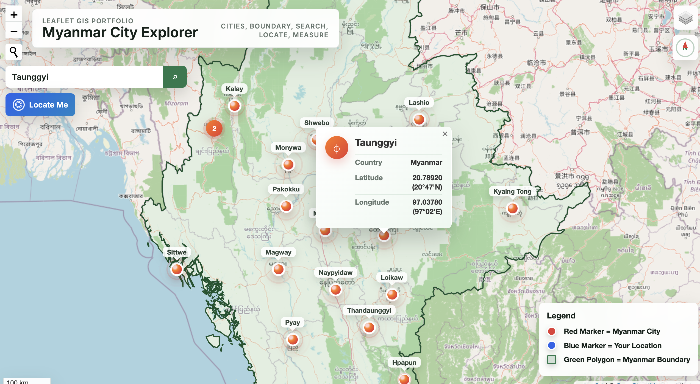

# Myanmar City Explorer

Myanmar City Explorer is a static Leaflet GIS web application for exploring Myanmar cities with clustered animated markers, permanent labels, city search, geolocation, measurement tools, base-map switching, and a Myanmar boundary overlay.

The project is designed for GitHub Pages and uses only HTML, CSS, vanilla JavaScript, relative file paths, local data files, and CDN-hosted libraries.

## Features

- OpenStreetMap and Esri World Imagery base maps
- Animated pulsing city markers with hover and click effects
- Permanent city labels above every marker
- Modern city popups with country and coordinate details
- Marker clustering with smooth expansion
- CSV data loading through PapaParse
- City search with automatic zoom, highlight, and popup opening
- Locate Me control with blue location marker and accuracy circle
- Distance and area measuring tool
- Myanmar boundary GeoJSON overlay
- Legend, scale bar, and compass control
- Loading animation while CSV data renders
- Responsive desktop, tablet, and mobile layout
- Error handling for missing data, duplicate rows, and failed CSV loads

## Folder Structure

```text
/
├── index.html
├── README.md
├── css/
│   └── style.css
├── js/
│   └── script.js
├── data/
│   ├── myanmar_cities.csv
│   └── myanmar.geojson
└── assets/
```

## Libraries Used

- [Leaflet.js](https://leafletjs.com/)
- [PapaParse](https://www.papaparse.com/)
- [Leaflet MarkerCluster](https://github.com/Leaflet/Leaflet.markercluster)
- [Leaflet Control Geocoder](https://github.com/perliedman/leaflet-control-geocoder)
- [Leaflet Locate Control](https://github.com/domoritz/leaflet-locatecontrol)
- [Leaflet Measure](https://github.com/ljagis/leaflet-measure)
- OpenStreetMap tiles
- Esri World Imagery tiles

## Data

City data is loaded from:

```text
data/myanmar_cities.csv
```

Required CSV columns:

```text
Country,City,Latitude,Longitude,Latitude_Decimal,Longitude_Decimal
```

Boundary data is loaded from:

```text
data/myanmar.geojson
```

The included boundary uses geoBoundaries gbOpen Myanmar ADM0 GeoJSON, sourced from OpenStreetMap and represented for 2021. Review licensing and suitability before using it for formal GIS analysis.

## Deploy on GitHub Pages

1. Push this project to a GitHub repository.
2. Open the repository settings.
3. Go to **Pages**.
4. Choose the branch that contains `index.html`, usually `main`.
5. Select the root folder and save.
6. Open the published GitHub Pages URL.

No build step, Node.js, npm, or server-side code is required.

## Screenshots

Add screenshots here after deployment:

```md

```

## Future Improvements

- Replace the placeholder boundary with a high-quality official GeoJSON boundary.
- Add administrative region filters.
- Add downloadable CSV or GeoJSON exports.
- Add city categories, population, or regional metadata.
- Add offline tile support for field demonstrations.
